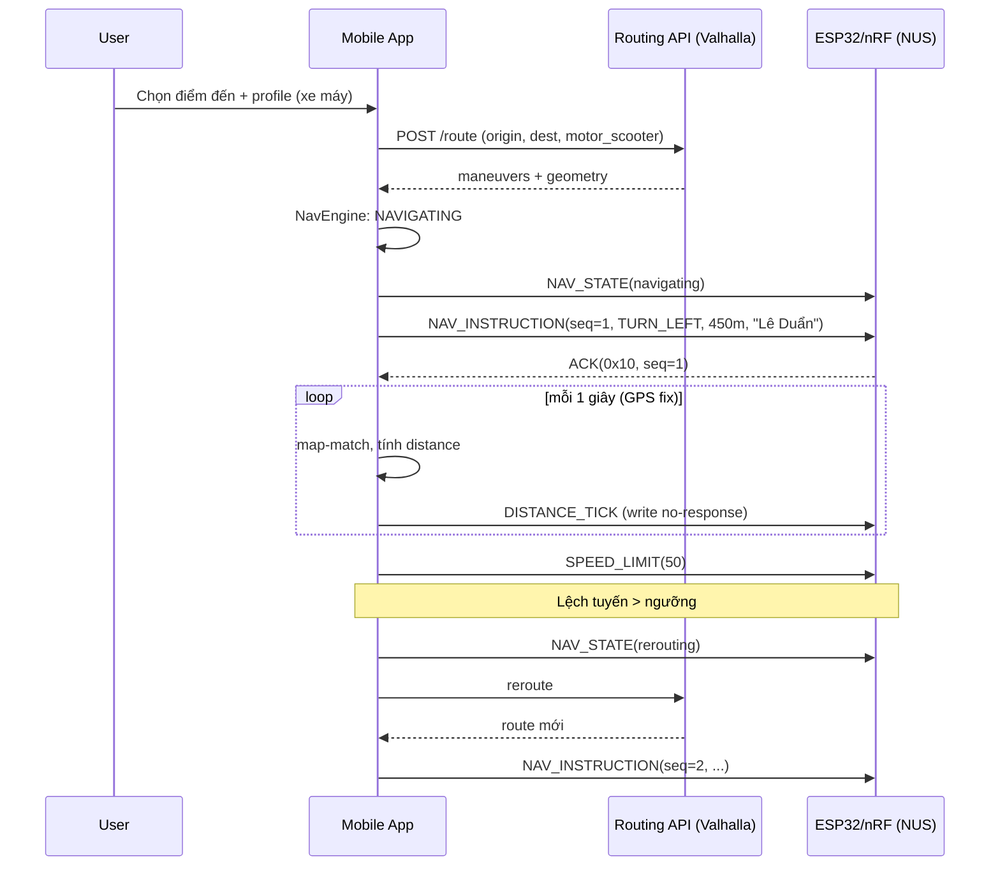

# Tài liệu Thiết kế — Ứng dụng Chỉ đường Di động + BLE Companion (ESP32/nRF)

**Phiên bản:** 0.2 (bổ sung toolchain, dependencies, thiết kế UI chi tiết)
**Ngày:** 2026-06-12
**Phạm vi:** Mobile app (Android/iOS) — bản đồ, dẫn đường ô tô / xe máy / xe đạp, cảnh báo biển báo giao thông, và kênh BLE (Nordic UART Service) đẩy thông tin dẫn đường xuống thiết bị nhúng (ESP32 / nRF52).

---

## 1. Tổng quan & Mục tiêu

### 1.1 Bài toán
Người dùng cần một ứng dụng dẫn đường trên điện thoại, đồng thời hiển thị thông tin dẫn đường (rẽ trái/phải, khoảng cách, tốc độ giới hạn, biển báo) trên một **thiết bị phụ gắn trên xe** (HUD trên ô tô, màn hình OLED trên xe máy/xe đạp, đồng hồ tự chế...) chạy ESP32 hoặc nRF52, kết nối qua BLE.

### 1.2 Mục tiêu sản phẩm
| # | Mục tiêu | Ưu tiên |
|---|----------|---------|
| G1 | Hiển thị bản đồ, tìm kiếm địa điểm, tính tuyến đường | P0 |
| G2 | Dẫn đường turn-by-turn cho 3 profile: ô tô, xe máy, xe đạp | P0 |
| G3 | Hiển thị/cảnh báo biển báo giao thông trên tuyến (tốc độ, cấm rẽ, camera...) | P1 |
| G4 | Kết nối BLE tới thiết bị nhúng qua NUS, đẩy dữ liệu dẫn đường real-time | P0 |
| G5 | Hoạt động ổn định khi app chạy nền (background navigation + BLE) | P0 |
| G6 | Offline map / offline routing (giai đoạn sau) | P2 |

### 1.3 Non-goals (phiên bản đầu)
- Không làm social/chia sẻ vị trí.
- Không tự xây dữ liệu bản đồ; dùng OSM / dịch vụ thương mại.
- Không nhận diện biển báo bằng camera (để Phase 3, optional ML Kit).

---

## 2. Kiến trúc tổng thể

### 2.1 Sơ đồ khối

```
┌─────────────────────────────────────────────────────────┐
│                      Mobile App                          │
│  ┌────────────┐ ┌─────────────┐ ┌────────────────────┐  │
│  │  UI Layer  │ │ Navigation  │ │  BLE Bridge        │  │
│  │ Map/Search │ │ Engine      │ │  (NUS Central)     │  │
│  │ TBT Banner │ │ Route/Reroute│ │ Codec + Tx Queue  │  │
│  └─────┬──────┘ └──────┬──────┘ └─────────┬──────────┘  │
│        │               │                  │             │
│  ┌─────┴───────────────┴──────────────────┴──────────┐  │
│  │              Core Services Layer                   │  │
│  │  Location Service │ Route Service │ Sign Service   │  │
│  └─────┬───────────────────┬──────────────────────────┘  │
└────────┼───────────────────┼─────────────────────────────┘
         │ GPS/GNSS          │ HTTPS
   ┌─────┴─────┐      ┌──────┴────────────┐
   │  OS GNSS  │      │ Routing/Tile API  │
   └───────────┘      │ (OSRM/Valhalla/   │
                      │  Mapbox/Goong)    │
                      └───────────────────┘
         BLE GATT (NUS)
         │
   ┌─────┴──────────────┐
   │ ESP32 / nRF52      │
   │ NUS Peripheral     │
   │ Parser → Display   │
   └────────────────────┘
```

### 2.2 Nguyên tắc thiết kế
- **Layered + interface-driven**: Navigation Engine không biết gì về BLE; nó phát sự kiện `NavEvent` qua một event bus, BLE Bridge là một *subscriber*. Sau này thêm subscriber khác (Wear OS, Android Auto) không sửa engine.
- **Codec tách rời transport**: bộ encode/decode khung NUS là module thuần (pure functions), unit-test được, dùng chung spec với firmware.
- **Single source of truth**: trạng thái dẫn đường (route hiện tại, bước hiện tại, distance-to-maneuver) nằm trong một state machine duy nhất; UI và BLE chỉ render từ state này.

---

## 3. Môi trường build & Lựa chọn công nghệ

### 3.1 Toolchain (chốt theo môi trường dự án)

| Thành phần | Phiên bản | Ghi chú |
|---|---|---|
| Flutter SDK | **3.44.0** (stable) | |
| Dart SDK | **3.12.0** | |
| Android compileSdk / targetSdk | **36** | Android SDK 36.1.0 |
| Android minSdk | **26** (Android 8.0) | BLE + Foreground Service ổn định từ API 26; permission model gọn hơn (BLE plugin chỉ yêu cầu ≥ 21) |
| Kotlin | **2.2.x** | |
| Gradle | **9.x** | Yêu cầu AGP ≥ 8.13 |
| Android Gradle Plugin (AGP) | **8.13.x** (hoặc 9.x nếu Flutter template đã hỗ trợ) | Tương thích Gradle 9 + JDK 21 |
| Java | **OpenJDK 21** | `jvmToolchain(21)` |
| iOS deployment target | 14.0 | Nếu làm iOS ở phase sau |

**`android/app/build.gradle.kts` (trích):**
```kotlin
android {
    compileSdk = 36
    defaultConfig {
        minSdk = 26
        targetSdk = 36
    }
    compileOptions {
        sourceCompatibility = JavaVersion.VERSION_21
        targetCompatibility = JavaVersion.VERSION_21
    }
    kotlin { jvmToolchain(21) }
}
```

### 3.2 Lựa chọn công nghệ

| Thành phần | Đề xuất chính | Phương án thay thế | Ghi chú |
|---|---|---|---|
| Map render | **`maplibre_gl`** | gói `maplibre` (rewrite FFI/JNI, mới) | `maplibre_gl` 0.26.x (4/2026) vừa được vực dậy mạnh: offline regions làm lại toàn bộ, tap handling ổn định — phù hợp app navigation. Gói `maplibre` mới hiệu năng tốt nhưng API còn biến động. Bọc sau interface `IMapView` để đổi được về sau |
| Tile/Geocoding (VN) | **Goong.io** hoặc OSM tiles + Nominatim | Mapbox, Google | Goong dữ liệu VN tốt, giá rẻ hơn Google |
| Routing engine | **Valhalla** (self-host hoặc API) | OSRM, GraphHopper | Valhalla có sẵn profile `auto`, `motor_scooter` (xe máy!), `bicycle` — đúng 3 profile cần. OSRM mặc định không có profile xe máy |
| Turn-by-turn logic | Tự viết trên maneuver list của Valhalla | Mapbox Navigation SDK (trả phí) | Tự viết để kiểm soát event đẩy xuống BLE |
| BLE | **`flutter_blue_plus`** (Central) | `bluetooth_low_energy`, `universal_ble` | ⚠️ **Lưu ý license**: flutter_blue_plus hiện yêu cầu **commercial license** cho mục đích for-profit (free cho cá nhân/phi lợi nhuận). Dự án outsourcing/thương mại: hoặc mua license, hoặc dùng `bluetooth_low_energy` (BSD). Bọc sau interface `IBleTransport` (Strategy/DI — giống UART Manager bạn từng làm) để swap plugin không đụng codec |
| Biển báo | OSM tags (`maxspeed`, `traffic_sign`, `enforcement`) theo tuyến | DB riêng (crowdsource) | Phase 1: speed limit + camera |
| State management | **Riverpod 3** | Bloc | Provider graph rõ ràng, test dễ |
| Local DB | SQLite qua **drift** | Hive/Isar | Type-safe, codegen — hợp khẩu vị descriptor-driven |

### 3.3 Dependencies (`pubspec.yaml`)

> Version dưới đây là **mốc tối thiểu** hợp lệ tại thời điểm viết (06/2026), dùng caret để nhận bản vá. Khi setup chạy `flutter pub outdated` để chốt lockfile.

```yaml
environment:
  sdk: ^3.12.0
  flutter: ">=3.44.0"

dependencies:
  flutter:
    sdk: flutter

  # ── State & DI ──────────────────────────
  flutter_riverpod: ^3.0.0
  riverpod_annotation: ^3.0.0

  # ── Map & Location ──────────────────────
  maplibre_gl: ^0.26.0
  geolocator: ^14.0.0          # GPS stream 1 Hz, accuracy filter

  # ── BLE ─────────────────────────────────
  flutter_blue_plus: ^1.36.0   # ⚠️ commercial license — xem §3.2

  # ── Network ─────────────────────────────
  dio: ^5.9.0                  # Routing/Overpass API, retry + interceptor

  # ── Storage ─────────────────────────────
  drift: ^2.28.0
  sqlite3_flutter_libs: ^0.5.36
  path_provider: ^2.1.5
  shared_preferences: ^2.5.0   # settings nhẹ

  # ── Voice & background ──────────────────
  flutter_tts: ^4.2.0          # giọng đọc vi-VN
  flutter_foreground_task: ^9.0.0  # foreground service Android (location + connectedDevice)
  wakelock_plus: ^1.2.0        # giữ màn hình khi navigate
  permission_handler: ^12.0.0

  # ── UI & Font ───────────────────────────
  google_fonts: ^6.3.0
  flutter_svg: ^2.0.0          # icon maneuver, biển báo dạng SVG

dev_dependencies:
  build_runner: ^2.5.0
  drift_dev: ^2.28.0
  riverpod_generator: ^3.0.0
  flutter_lints: ^6.0.0
  mocktail: ^1.0.0             # mock IBleTransport, IRouteService
```

Polyline6 decoder của Valhalla: **tự viết** (~30 dòng), không cần thêm package.

### 3.4 Font & tiếng Việt (quan trọng)

**Vấn đề:** font thiếu glyph/diacritics tiếng Việt gây lỗi dấu (ơ, ư, ậ, ẫ bị thay bằng ô vuông hoặc lệch baseline do fallback font), đặc biệt trên máy Android Trung Quốc/ROM lạ.

**Giải pháp:**
1. Dùng Google Fonts có **Vietnamese subset đầy đủ**:
   - **Be Vietnam Pro** — thiết kế riêng cho tiếng Việt, dấu đặt chuẩn → dùng cho heading, tên đường trên banner dẫn đường.
   - **Inter** — Vietnamese subset tốt, có **tabular figures** (`FontFeature.tabularFigures()`) → dùng cho body và **mọi con số** (khoảng cách, tốc độ, ETA) để số không "nhảy" bề ngang khi thay đổi mỗi giây.
2. **Bundle font vào assets, KHÔNG để `google_fonts` tải runtime**: app dẫn đường phải chạy được offline; lần chạy đầu không có mạng → google_fonts fallback về font hệ thống → lỗi dấu. Cách làm:
   - Tải `.ttf` (Be Vietnam Pro 400/600/700, Inter 400/500/700) vào `assets/fonts/`, khai báo trong `pubspec.yaml`;
   - `GoogleFonts.config.allowRuntimeFetching = false;` trong `main()` — package tự ưu tiên font trong assets.
3. Theme:
```dart
final textTheme = TextTheme(
  displayLarge: GoogleFonts.beVietnamPro(fontWeight: FontWeight.w700),
  titleLarge:   GoogleFonts.beVietnamPro(fontWeight: FontWeight.w600),
  bodyMedium:   GoogleFonts.inter(),
  labelLarge:   GoogleFonts.inter(fontWeight: FontWeight.w500),
);
```
4. Chuỗi gửi xuống thiết bị nhúng là UTF-8 — màn hình OLED phía firmware cần font Việt riêng (vd `u8g2` + font Unicode subset, hoặc bảng chuyển có dấu → không dấu nếu RAM hạn chế; capability bitmap trong `DEVICE_INFO` khai báo thiết bị có hỗ trợ dấu hay không, app tự bỏ dấu khi cần).

---

## 4. Thiết kế các module chính

### 4.1 Map Module
- Hiển thị tile vector (MapLibre style JSON), camera follow theo GPS với 2 chế độ: north-up và heading-up.
- Vẽ polyline tuyến đường (route geometry — polyline6 decode từ Valhalla).
- Marker: vị trí hiện tại (mũi tên xoay theo bearing), điểm đến, biển báo trên tuyến.
- Search: geocoding API + lịch sử + favorites (SQLite).

### 4.2 Routing Module
**Input:** origin (GPS), destination, profile ∈ {auto, motor_scooter, bicycle}, tuỳ chọn (tránh phí, tránh cao tốc — xe máy mặc định tránh cao tốc).

**Output (chuẩn hoá nội bộ — `RouteModel`):**
```
RouteModel
 ├─ geometry: List<LatLng>
 ├─ distanceM, durationS
 └─ legs[] → maneuvers[]
      ├─ type: ManeuverType (enum nội bộ, map từ Valhalla)
      ├─ instructionText: String (tiếng Việt)
      ├─ streetName: String
      ├─ location: LatLng
      ├─ distanceToNextM
      └─ exitNumber / roundaboutExit (nếu có)
```

Chuẩn hoá `ManeuverType` thành enum riêng ngay tại adapter — đây là enum sẽ **dùng chung với firmware** (xem §6.3), nên phải ổn định, không phụ thuộc Valhalla.

### 4.3 Navigation Engine (turn-by-turn)
State machine:

```
IDLE → ROUTING → NAVIGATING ↔ OFF_ROUTE(rerouting) → ARRIVED
```

Vòng lặp xử lý mỗi GPS fix (1 Hz):
1. **Map-matching**: chiếu vị trí GPS lên geometry tuyến (tìm đoạn gần nhất, hysteresis để không nhảy đoạn).
2. Tính `distanceToManeuver`, `distanceRemaining`, `etaSeconds`.
3. **Off-route detection**: lệch > 35 m (ô tô) / 25 m (xe máy, xe đạp) trong ≥ 3 fix liên tiếp → reroute.
4. Phát `NavEvent` lên event bus:
   - `InstructionChanged` (sang maneuver mới)
   - `DistanceTick` (mỗi 1 s)
   - `SpeedLimitChanged`, `SignApproaching`
   - `Rerouting`, `Arrived`
5. Ngưỡng nhắc bằng giọng nói/hiển thị: 1000 m / 300 m / 100 m / "bây giờ" (tuỳ profile và tốc độ).

**Background:** Android dùng Foreground Service (type `location` + `connectedDevice`); iOS bật background mode `location` + `bluetooth-central`.

### 4.4 Traffic Sign Module
- Khi có route: query Overpass API (hoặc backend riêng cache sẵn) lấy node/way dọc hành lang tuyến (buffer ~30 m): `maxspeed`, `highway=speed_camera`, `traffic_sign=*`, biển cấm rẽ.
- Gắn các sign vào "linear reference" của tuyến (offset mét từ điểm đầu) → khi xe chạy, so offset hiện tại để bắn cảnh báo trước X mét (X phụ thuộc tốc độ, ví dụ 10 s di chuyển).
- Cache theo tile/route trong SQLite để giảm gọi mạng và phục vụ offline một phần.

### 4.5 BLE Bridge Module — xem chi tiết §5–6.

---

## 5. Thiết kế kết nối BLE (NUS)

### 5.1 Vai trò & UUID
- **Điện thoại = Central**, **ESP32/nRF = Peripheral** advertise NUS.
- Nordic UART Service (chuẩn de-facto):

| Đối tượng | UUID |
|---|---|
| NUS Service | `6E400001-B5A3-F393-E0A9-E50E24DCCA9E` |
| RX Characteristic (phone → device, Write/Write No Response) | `6E400002-B5A3-F393-E0A9-E50E24DCCA9E` |
| TX Characteristic (device → phone, Notify) | `6E400003-B5A3-F393-E0A9-E50E24DCCA9E` |

> Lưu ý chiều: **RX/TX đặt theo góc nhìn của thiết bị nhúng** (giống firmware Nordic mẫu). App ghi vào RX char; app subscribe TX char để nhận phản hồi/ACK/lệnh từ thiết bị.

### 5.2 Quy trình kết nối
1. Scan filter theo NUS service UUID (+ tên `NAVHUD-xxxx` để lọc nhanh).
2. Connect → request **MTU 247** (Android; iOS tự negotiate ~185). Lưu MTU thực tế để codec quyết định fragment.
3. Request connection priority HIGH khi đang navigate (Android `CONNECTION_PRIORITY_HIGH`, interval ~11.25–15 ms); hạ về BALANCED khi idle để tiết kiệm pin thiết bị.
4. Discover service, enable notify trên TX char.
5. Handshake: app gửi `HELLO`, thiết bị trả `DEVICE_INFO` (fw version, screen size, capability bitmap) → app điều chỉnh nội dung gửi (vd màn 128×32 thì rút gọn street name).
6. Bonding: optional (NUS thường không yêu cầu); nếu sản phẩm thật nên bật LE Secure Connections + whitelist để chống thiết bị lạ ghi đè.

### 5.3 Chính sách truyền & độ tin cậy
- **Write Without Response** cho dữ liệu chu kỳ (DistanceTick) — throughput tốt, mất 1 gói không sao vì gói sau ghi đè.
- **Write With Response (hoặc app-level ACK)** cho gói quan trọng: `INSTRUCTION`, `REROUTE`, `ARRIVED`.
- **Tx Queue + coalescing**: nếu queue đầy (BLE chậm), gói `DistanceTick` mới *thay thế* gói cũ chưa gửi (chỉ giữ bản mới nhất); gói `INSTRUCTION` không bao giờ bị drop.
- **Reconnect**: supervision timeout → auto-reconnect với backoff 1/2/4/8 s; khi nối lại, gửi **full state snapshot** (instruction hiện tại + distance + speed limit) để màn hình đồng bộ ngay.
- Heartbeat 5 s hai chiều để phát hiện half-open connection.

---

## 6. Giao thức ứng dụng trên NUS (binary protocol)

NUS chỉ là "ống UART" — cần định nghĩa framing + message. Thiết kế dưới đây tối ưu cho MCU: parse không cần malloc, struct-friendly, chịu được fragment qua nhiều notify/write.

### 6.1 Khung (frame)

```
┌──────┬──────┬─────────┬─────────────┬───────┐
│ SOF  │ TYPE │ LEN     │ PAYLOAD     │ CRC16 │
│ 0xA5 │ u8   │ u8      │ LEN bytes   │ u16 LE│
└──────┴──────┴─────────┴─────────────┴───────┘
```
- `LEN` = độ dài payload (0–200) → frame tối đa 205 byte, vừa trong 1 write khi MTU ≥ 208; nếu MTU nhỏ, codec cắt frame thành nhiều write, parser phía MCU là **byte-stream state machine** (SOF → TYPE → LEN → PAYLOAD → CRC) nên không phụ thuộc ranh giới gói BLE.
- `CRC16` = CRC-16/MCRF4XX (poly 0x1021, init 0xFFFF, refin/refout, xorout 0x0000), 2 byte little-endian, tính trên TYPE+LEN+PAYLOAD.
- Mọi số multi-byte: **little-endian** (khớp Cortex-M, đỡ swap).

### 6.2 Bảng message

| TYPE | Tên | Chiều | Tần suất | Payload |
|---|---|---|---|---|
| 0x01 | HELLO | App→Dev | 1 lần | proto_ver u8 |
| 0x02 | DEVICE_INFO | Dev→App | trả lời HELLO | fw_ver u16, cap_bitmap u16, max_text u8 |
| 0x10 | NAV_INSTRUCTION | App→Dev | khi đổi maneuver | xem §6.3 |
| 0x11 | DISTANCE_TICK | App→Dev | 1 Hz | dist_to_man u16 (m), dist_remain u32 (m), eta u16 (min), speed u8 (km/h) |
| 0x12 | SPEED_LIMIT | App→Dev | khi đổi | limit u8 (km/h, 0=unknown), is_over u8 |
| 0x13 | TRAFFIC_SIGN | App→Dev | khi tới gần | sign_type u8 (enum), dist u16 (m), value u8 |
| 0x14 | NAV_STATE | App→Dev | khi đổi | state u8 (idle/navigating/rerouting/arrived) |
| 0x15 | LANE_INFO | App→Dev | optional | lane_count u8, lane_bitmap[] |
| 0x20 | ACK | Dev→App | theo gói cần ACK | acked_type u8, seq u8 |
| 0x21 | BTN_EVENT | Dev→App | khi bấm nút trên HUD | btn u8, action u8 (vd: mute, repeat, zoom) |
| 0x7E | HEARTBEAT | 2 chiều | 5 s | uptime u32 |

#### 6.2.1 MAP DATA — HUD đồ hoạ **full-screen** (TFT 240×320) — `0x30`–`0x32`

> **Phiên bản 0.3 — thiết kế lại cho HUD full-screen.** Bỏ mô hình "mini-map + map center = MAP_POSITION gần nhất". Thiết bị OLED 1 dòng có thể bỏ qua nhóm này.

**Mô hình hiển thị (chốt):** ESP32 vẽ **bản đồ chiếm toàn bộ 240×320**, thông tin dẫn đường (mũi tên rẽ + khoảng cách, tốc độ, ETA, biển báo, trạng thái BLE/GPS) là **overlay bán trong suốt** vẽ ĐÈ lên map (dữ liệu overlay lấy từ §6.2/§6.3: NAV_INSTRUCTION/DISTANCE_TICK/SPEED_LIMIT/NAV_STATE — không lặp lại trong nhóm map).

**Ai chiếu toạ độ:** **ESP32 tự chiếu** (app không biết kích thước màn HUD). App chỉ gửi hình học ở hệ **mét địa lý north-up** quanh một điểm *anchor* tuyệt đối; ESP32 mỗi khung tự: (1) dịch theo `live_pose − anchor`, (2) **xoay −heading** (heading-up), (3) scale theo zoom (auto theo speed), (4) đặt user ở **giữa-dưới** màn. Vì offset là north-up nên **đổi heading KHÔNG cần gửi lại** route/roads — chỉ MAP_POSE đổi.

**Tiết kiệm băng thông (yêu cầu cứng):** chỉ `MAP_POSE` gửi thường xuyên (~3–5 m hoặc ~2 Hz, ~16 byte/gói, Write-No-Response, coalesce). `MAP_ROUTE`/`MAP_ROADS` gửi **hiếm**: khi bắt đầu/reroute, hoặc khi user rời anchor > ~800 m. Trước khi gửi: simplify (Douglas–Peucker) + **clip cửa sổ ~1.2 km** quanh user (chỉ phần HUD nhìn thấy).

| TYPE | Tên | Chiều | Tần suất | Payload (little-endian) |
|---|---|---|---|---|
| 0x30 | MAP_POSE | App→Dev | thường xuyên (~2 Hz) | `lat` i32 (deg×1e7), `lng` i32 (deg×1e7), `heading` u16 (0.1°, 0..3599), `speed` u8 (km/h), `flags` u8 (bit0 gps_fix, bit1 off_route, bit2 navigating) — **12 byte** |
| 0x31 | MAP_ROUTE | App→Dev | hiếm | **header**: `anchor_lat` i32, `anchor_lng` i32, `seq` u8, `frag_idx` u8, `frag_total` u8, `n` u16; **rồi** `n`×{`east` i16, `north` i16} (decimet so với anchor, north-up). Fragment nhiều frame cùng `seq` khi LEN>200 |
| 0x32 | MAP_ROADS | App→Dev | hiếm | **header**: `anchor_lat` i32, `anchor_lng` i32, `seq` u8, `road_count` u8; **rồi** mỗi road: `class` u8 (`HighwayType.value`), `pt_count` u8, `pt_count`×{`east` i16, `north` i16} (dm). Ưu tiên road **gần tuyến đường chính nhất** (khả năng giao cắt cao) trước, đồng hạng thì `class` nhỏ (đường lớn) trước; cắt về `MAP_MAX_ROADS` (firmware) khi vượt budget; fragment theo `seq` nếu cần |
| 0x33 | MAP_CLOCK | App→Dev | mỗi 30 s + khi reconnect | `epoch_s` u32 (Unix time, UTC), `tz_offset_min` i16 (lệch giờ địa phương, phút) — ESP32 tick nội bộ giữa các lần sync bằng tick LVGL có sẵn |

Ghi chú encode:
- `east`/`north` = mét×10 (dm) từ anchor theo mặt phẳng tiếp tuyến cục bộ (equirectangular): `east = (lng−anchor_lng)·cos(anchor_lat)·111320`, `north = (lat−anchor_lat)·111320`. i16 dm cho dải ±3276.7 m — đủ cho cửa sổ 1.2 km.
- ESP32 đổi `anchor` và `live_pose` (đều tuyệt đối) sang cùng hệ mét để biết user nằm đâu trong route/roads → không cần app canh giữa.
- `seq` tăng mỗi lần gửi bộ ROUTE/ROADS mới; ESP32 chỉ giữ bộ có `seq` mới nhất, đủ `frag_total` mảnh mới swap để vẽ (double-buffer).

### 6.3 NAV_INSTRUCTION (0x10) — gói quan trọng nhất

```c
typedef struct __attribute__((packed)) {
    uint8_t  seq;            // tăng dần, phục vụ ACK
    uint8_t  maneuver;       // enum bên dưới
    uint16_t distance_m;     // khoảng cách tới điểm rẽ
    uint8_t  exit_number;    // vòng xuyến: lối ra thứ N, 0 nếu N/A
    uint8_t  name_len;       // 0..48
    char     street_name[];  // UTF-8, cắt theo max_text của device
} nav_instruction_t;
```

```c
typedef enum {
    MAN_DEPART = 0, MAN_STRAIGHT, MAN_TURN_SLIGHT_LEFT, MAN_TURN_LEFT,
    MAN_TURN_SHARP_LEFT, MAN_UTURN, MAN_TURN_SHARP_RIGHT, MAN_TURN_RIGHT,
    MAN_TURN_SLIGHT_RIGHT, MAN_ROUNDABOUT, MAN_EXIT_LEFT, MAN_EXIT_RIGHT,
    MAN_MERGE, MAN_FERRY, MAN_ARRIVE, MAN_ARRIVE_LEFT, MAN_ARRIVE_RIGHT,
} maneuver_e;
```

Enum này định nghĩa **một lần trong file header dùng chung** (`nav_proto.h`) — firmware include trực tiếp, app sinh code từ cùng spec (giống pattern descriptor-driven codegen bạn đã làm với CLI framework: một file JSON/header là source of truth, sinh encoder Dart + decoder C).

### 6.4 Phía firmware (ESP32 / nRF52) — phác thảo
- **nRF52**: dùng `ble_nus` trong nRF5 SDK hoặc NUS service của Zephyr (`bt_nus`); RX callback đẩy byte vào ring buffer → task parser (state machine ở §6.1) → cập nhật `display_model_t` → task render OLED/TFT. Pattern ISR-push + poll-loop giống module modem manager của bạn.
- **ESP32**: NimBLE, tự khai 3 UUID NUS; còn lại tương tự.
- Parser khuyến nghị: zero-copy, không malloc, timeout 200 ms reset state nếu frame dở dang — tái dùng tư duy line-classifier/tokenizer của AT framework.

---

## 7. Luồng hoạt động chính (sequence)



---

## 8. Yêu cầu phi chức năng

| Hạng mục | Yêu cầu |
|---|---|
| Độ trễ instruction → hiển thị HUD | < 300 ms (conn interval HIGH) |
| Pin điện thoại | Navigation + BLE 1 giờ tiêu < 15% (màn hình tắt) |
| GPS update | 1 Hz, map-matching chịu được nhiễu đô thị (nhà cao tầng) |
| Reconnect BLE | < 5 s sau khi vào lại vùng phủ |
| Quyền | Android: `ACCESS_FINE_LOCATION`, `BLUETOOTH_SCAN/CONNECT`, `FOREGROUND_SERVICE`; iOS: location always + bluetooth |
| Bảo mật | Phase 2: bonding LE Secure Connections; CRC chỉ chống lỗi, không chống giả mạo |

---

## 9. Roadmap

**Phase 1 — MVP (4–6 tuần)**
- Map + search + route ô tô/xe máy/xe đạp (Valhalla API)
- Turn-by-turn cơ bản (banner + voice TTS)
- BLE NUS: HELLO, NAV_INSTRUCTION, DISTANCE_TICK, NAV_STATE
- Firmware mẫu ESP32 + OLED 128×64 làm reference device

**Phase 2 — Hoàn thiện**
- Speed limit + camera + biển báo từ OSM, cảnh báo trước theo tốc độ
- Reroute mượt, background navigation ổn định cả 2 OS
- ACK/seq đầy đủ, reconnect snapshot, BTN_EVENT từ HUD
- Bonding/secure pairing

**Phase 3 — Mở rộng**
- Offline map (MBTiles) + offline routing (Valhalla on-device)
- Lane guidance, nhận diện biển báo bằng camera (ML Kit) — optional
- OTA firmware cho HUD qua chính kênh BLE (tận dụng kinh nghiệm secure OTA của dự án STM32H523)

---

## 10. Rủi ro & điểm cần quyết sớm

1. **iOS background BLE + navigation đồng thời** — cần prototype sớm; nếu Flutter plugin không đủ, viết platform channel native.
2. **Chi phí routing API** — Valhalla self-host (VPS + OSM Vietnam extract ~ rẻ) vs API trả phí; nên benchmark chất lượng tuyến xe máy ở Hà Nội trước khi chốt.
3. **Dữ liệu biển báo OSM ở VN còn thưa** — chấp nhận coverage thấp ở Phase 1, tính phương án crowdsource.
4. **MTU iOS thấp hơn Android** — protocol đã thiết kế stream-based nên an toàn, nhưng cần test fragment thật trên iPhone cũ.

---

## 11. Thiết kế UI chi tiết

### 11.1 Design System

**Màu (Material 3 tokens, seed-based):**

| Token | Light | Dark / Night | Dùng cho |
|---|---|---|---|
| `primary` | `#1A73E8` (xanh dương) | `#8AB4F8` | Nút chính, tuyến đường đang chọn |
| `routeAlt` | `#9AA0A6` | `#5F6368` | Tuyến thay thế |
| `surface` | `#FFFFFF` | `#121212` | Nền sheet/panel |
| `navBanner` | `#0B8043` (xanh lá đậm) | `#0B8043` | Banner turn-by-turn (giữ nguyên 2 theme — nhận diện như biển chỉ dẫn) |
| `warning` | `#F9AB00` | `#FDD663` | Cảnh báo lệch tuyến, GPS yếu |
| `danger` | `#D93025` | `#F28B82` | Quá tốc độ, mất kết nối BLE |
| `bleConnected` | `#188038` | `#81C995` | Trạng thái BLE |

**Typography (Be Vietnam Pro + Inter, xem §3.4):**

| Style | Font | Size/Weight | Dùng cho |
|---|---|---|---|
| `navDistance` | Inter (tabular) | 40sp / 800 | "350 m" trên banner |
| `navStreet` | Be Vietnam Pro | 24sp / 600, max 2 dòng ellipsis | "Đường Lê Duẩn" |
| `speedValue` | Inter (tabular) | 28sp / 700 | Ô tốc độ hiện tại |
| `titleLarge` | Be Vietnam Pro | 20sp / 600 | Tiêu đề màn hình, sheet |
| `bodyMedium` | Inter | 14sp / 400 | Nội dung chung |
| `labelSmall` | Inter | 11sp / 500 | Chip, badge |

**Quy tắc chung:** lưới spacing 4dp; bo góc 12dp (card), 28dp (sheet, search bar); **touch target tối thiểu 56×56dp ở chế độ navigation** (đang lái xe, đeo găng tay — lớn hơn chuẩn 48dp của Material); vùng thao tác chính dồn về nửa dưới màn hình (one-hand reach khi gắn điện thoại trên xe).

### 11.2 Information Architecture

```
App (map-first, không dùng bottom navigation)
└─ S1 Map Home
   ├─ S2 Search (full-screen)
   │   └─ S3 Route Preview (bottom sheet trên map)
   │        └─ S4 Navigation (full-screen)
   ├─ S5 BLE Device Manager (push từ icon trạng thái / Settings)
   └─ S6 Settings
```

Triết lý: bản đồ luôn là nền; mọi thứ khác là **bottom sheet hoặc overlay** trượt lên trên map — người dùng không bao giờ "rời khỏi" bản đồ.

### 11.3 S1 — Map Home

```
┌──────────────────────────────┐
│ ┌──────────────────────────┐ │ ← Search bar (radius 28,
│ │ 🔍  Tìm địa điểm…    [⚙] │ │   elevation 2, đè lên map)
│ └──────────────────────────┘ │
│ ┌────┐                       │
│ │BLE✓│  ← chip trạng thái    │
│ └────┘     (góc trái)        │
│                              │
│          [ MAP ]             │
│        ▲ vị trí + bearing    │
│                              │
│                       ┌───┐  │
│                       │ ⊕ │  │ ← FAB định vị lại
│                       └───┘  │
│ ┌──────────────────────────┐ │
│ │ 🚗 Ô tô │ 🛵 Xe máy │ 🚲 │ │ ← Profile selector
│ └──────────────────────────┘ │   (SegmentedButton, sticky)
└──────────────────────────────┘
```

- **BLE status chip** (4 trạng thái): Xám "Chưa ghép" → bấm mở S5; Vàng nhấp nháy "Đang kết nối…"; Xanh "HUD ✓" kèm tên thiết bị; Đỏ "Mất kết nối" (kèm auto-reconnect đếm ngược). Chip luôn hiển thị ở S1 và S4.
- Long-press lên map → drop pin → mini sheet "Chỉ đường tới đây".
- Nút la bàn xuất hiện khi map bị xoay; chạm để về north-up.

### 11.4 S2 — Search

- Search bar focus → mở full-screen, bàn phím bật ngay, debounce 300 ms gọi geocoding.
- Dưới ô nhập: 2 shortcut **Nhà / Công ty** (đặt trong Settings), tiếp theo là **Lịch sử** (SQLite, swipe-to-delete), rồi kết quả API.
- Mỗi kết quả: icon loại địa điểm, tên (Be Vietnam Pro 16sp), địa chỉ phụ (Inter 13sp, xám), khoảng cách đường chim bay.
- Chọn kết quả → về S1 với camera bay tới điểm đến + mở S3.

### 11.5 S3 — Route Preview (bottom sheet, 3 mức snap: 25% / 50% / 90%)

```
┌──────────────────────────────┐
│   [MAP: route chính đậm,     │
│    2 route phụ mờ, chạm để   │
│    đổi; auto-fit bounds]     │
│╔════════════════════════════╗│
│║ 24 phút  ·  8,5 km         ║│ ← route đang chọn
│║ Qua Đại lộ Thăng Long      ║│
│║ ⚠ 1 đoạn cấm xe máy        ║│ ← cảnh báo theo profile
│║──────────────────────────  ║│
│║ ◯ 27 phút · 7,9 km (ít rẽ) ║│ ← alternatives
│║──────────────────────────  ║│
│║ ☐ Tránh phí  ☐ Tránh cao tốc║│
│║ ┌────────────────────────┐ ║│
│║ │   ▶  BẮT ĐẦU (56dp)    │ ║│
│║ └────────────────────────┘ ║│
│╚════════════════════════════╝│
└──────────────────────────────┘
```

- Đổi profile ở S1 khi sheet đang mở → tự re-request route, sheet cập nhật.
- Kéo sheet lên 90% → danh sách maneuver từng bước (step list) để xem trước.

### 11.6 S4 — Navigation (màn hình quan trọng nhất)

```
┌──────────────────────────────┐
│╔════════════════════════════╗│
│║ ⬅      350 m               ║│ ← Banner xanh lá #0B8043
│║   Rẽ trái vào              ║│   icon maneuver 48dp
│║   Đường Lê Duẩn            ║│   chữ trắng
│╟────────────────────────────╢│
│║ Sau đó ↱ 200 m             ║│ ← "next maneuver" strip
│╚════════════════════════════╝│   (chỉ hiện khi < 500 m)
│ ┌────┐              ┌─────┐  │
│ │BLE✓│              │ ⌀50 │  │ ← biển tốc độ: vòng tròn
│ └────┘              └─────┘  │   viền đỏ nền trắng (kiểu
│                              │   biển VN), đỏ rực khi quá
│      [ MAP heading-up,       │
│        camera pitch 45°,     │
│        auto zoom theo speed ]│
│ ┌────┐                       │
│ │ 42 │ km/h ← speed hiện tại │
│ └────┘                       │
│╔════════════════════════════╗│
│║ [✕]   14:32 · 6,2 km · 18p ║│ ← bottom bar: ETA giờ đến,
│║        [🔇]  [📋]          ║│   còn lại; mute, step list
│╚════════════════════════════╝│
└──────────────────────────────┘
```

Chi tiết hành vi:
- `wakelock_plus` giữ màn hình sáng; **auto dark theme theo giờ mặt trời** (sunset/sunrise tính từ vị trí) — bắt buộc cho lái đêm.
- Banner đổi nội dung = một `NavEvent.InstructionChanged` duy nhất — cùng event đó đẩy xuống BLE (UI và HUD luôn khớp nhau, single source of truth §2.2).
- Cảnh báo biển báo/camera: toast dạng pill trượt xuống dưới banner, kèm icon biển báo SVG + khoảng cách, tự ẩn sau khi đi qua.
- Quá tốc độ: ô speed nhấp nháy đỏ + (tuỳ chọn) âm báo; đồng thời `SPEED_LIMIT.is_over=1` xuống HUD.
- Lệch tuyến: banner chuyển vàng "Đang tìm đường mới…" (state `OFF_ROUTE`), không hiện chỉ dẫn sai.
- Nút `✕` kết thúc: yêu cầu **giữ 1 giây** hoặc xác nhận dialog — tránh chạm nhầm khi xe xóc.
- GPS yếu (< 4 vệ tinh / accuracy > 30 m): chip cảnh báo "GPS yếu" góc trên, banner giữ chỉ dẫn cuối.

### 11.7 S5 — BLE Device Manager

```
┌──────────────────────────────┐
│ ←  Thiết bị HUD              │
│ ┌──────────────────────────┐ │
│ │ ● NAVHUD-3F2A   ĐÃ KẾT NỐI│ │ ← card thiết bị hiện tại
│ │ FW 1.2.0 · OLED 128×64    │ │   (từ DEVICE_INFO)
│ │ RSSI -61 dBm  MTU 247     │ │
│ │ [Gửi thử]  [Ngắt]  [Quên] │ │
│ └──────────────────────────┘ │
│ Thiết bị gần đây             │
│   NAVHUD-91BC      -78 dBm ↻ │ ← scan list, filter theo
│   NAVHUD-0D11      -85 dBm ↻ │   NUS UUID + prefix tên
│                              │
│ ☑ Tự kết nối lại khi mở app  │
│ ☑ Rung điện thoại khi mất BLE│
└──────────────────────────────┘
```

- **[Gửi thử]**: gửi frame `NAV_INSTRUCTION` mẫu ("Rẽ trái · 100 m · Kiểm tra hiển thị") — công cụ debug cho chính bạn khi phát triển firmware.
- Màn này có chế độ **debug console** ẩn (chạm 5 lần vào FW version): hiện log hex frame TX/RX hai chiều — rất hữu ích khi dò lỗi protocol với ESP32.

### 11.8 S6 — Settings (nhóm)

1. **Dẫn đường**: giọng đọc (TTS vi-VN, tốc độ đọc), đơn vị, ngưỡng cảnh báo tốc độ (+0/+5/+10 km/h), tự tránh cao tốc cho xe máy (mặc định bật).
2. **Hiển thị**: theme Sáng/Tối/Tự động theo giờ, cỡ chữ banner (Lớn/Rất lớn).
3. **Thiết bị HUD**: → S5; chọn nội dung gửi (đủ/gọn — màn nhỏ chỉ nhận icon + khoảng cách); bỏ dấu tiếng Việt khi gửi (tự động theo capability, có thể ép).
4. **Bản đồ & dữ liệu**: nguồn tile, xoá cache, (Phase 3: tải map offline).
5. **Địa điểm**: Nhà, Công ty, favorites.

### 11.9 Trạng thái rỗng / lỗi (empty & error states)

| Tình huống | UI |
|---|---|
| Chưa cấp quyền vị trí | Full-screen illustration + nút "Cấp quyền" → mở app settings nếu bị từ chối vĩnh viễn |
| Bluetooth tắt | Banner vàng trên S1/S5 + nút bật nhanh (Android) |
| Mất mạng khi tính route | Sheet lỗi + nút thử lại; nếu đang navigate thì giữ route cũ, chỉ báo "không reroute được" |
| Không tìm thấy thiết bị NUS | Hướng dẫn ngắn kèm hình: "Bật nguồn HUD, giữ nút pair…" |
